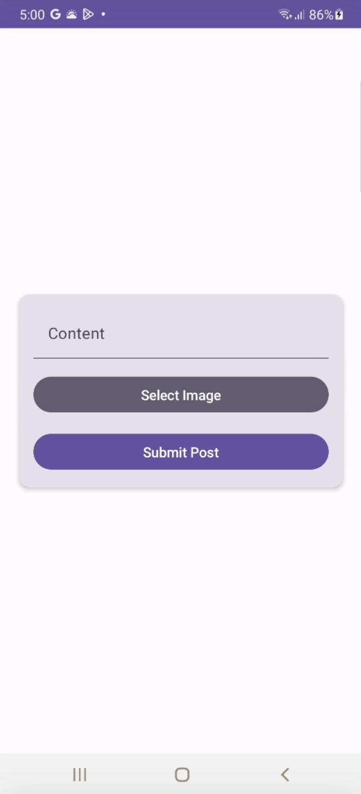
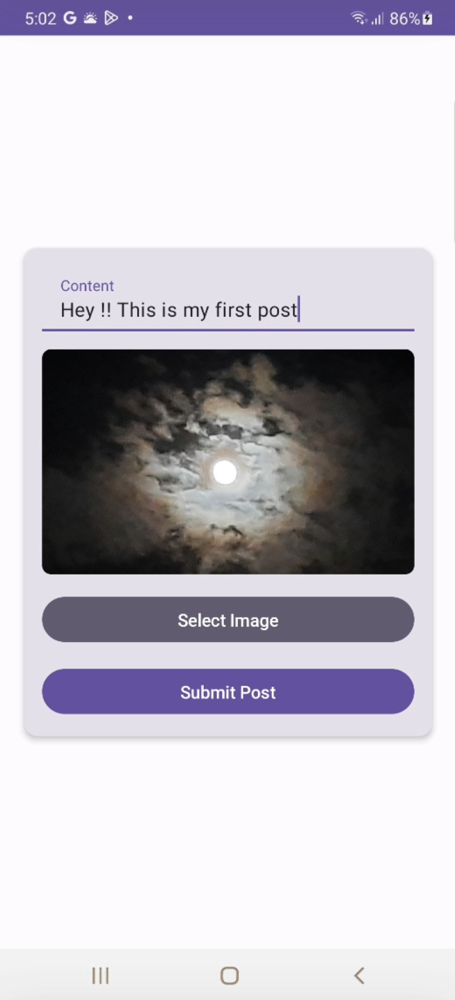
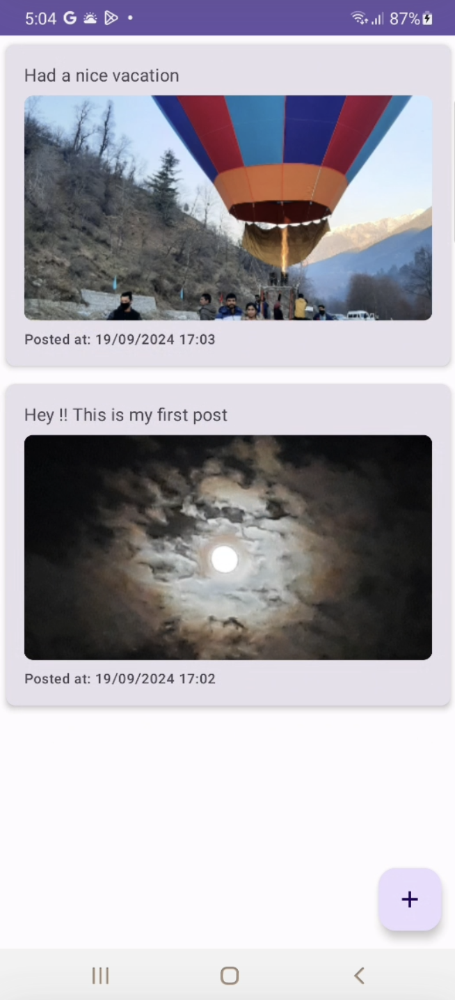

# SnapBook

SnapBook is an Android app built with Jetpack Compose that allows users to upload and view posts in real-time. This project uses Firebase Firestore for storing posts and Firebase Storage for media handling.

## Features
- View posts sorted by the latest on top
- Upload new posts with text content
- Real-time updates with Firebase Firestore

## Prerequisites
- Android Studio
- A Firebase account
- Basic knowledge of Jetpack Compose and Firebase

## Setup and Installation

### 1. Clone the Repository
```bash
git clone https://github.com/PRANEETH-METHUKU/SnapBook.git
cd SnapBook
```

### 2. Open the Project in Android Studio
- Open Android Studio.
- Select **File > Open** and choose the project directory you cloned.

### 3. Set Up Firebase
To use Firebase in this project, follow these steps:

#### a. Create a Firebase Project
- Go to the [Firebase Console](https://console.firebase.google.com/).
- Click **"Add project"** and follow the steps to create a new Firebase project.

#### b. Register Your App with Firebase
- In the Firebase Console, click on **"Add app"** and select the Android icon.
- Enter your app's package name (found in `app/build.gradle.kts`).
- Download the `google-services.json` file provided by Firebase.

#### c. Add `google-services.json` to Your Project
- Copy the `google-services.json` file you downloaded.
- Paste it into the `app` directory of your Android project.

#### d. Add Firebase SDK to the Project
- Firebase SDKs are already included in the project dependencies in the `build.gradle.kts` files:
    ```kotlin
    // app/build.gradle.kts
    plugins {
        id("com.android.application")
        kotlin("android")
        id("com.google.gms.google-services") // Apply Google services plugin
    }

    dependencies {
        implementation(platform("com.google.firebase:firebase-bom:32.2.0"))
        implementation("com.google.firebase:firebase-firestore-ktx")
        implementation("com.google.firebase:firebase-storage-ktx")
    }
    ```

- Make sure the following is also included in your project-level `build.gradle.kts` file:
    ```kotlin
    // build.gradle.kts
    buildscript {
        dependencies {
            classpath("com.google.gms:google-services:4.3.15") // Make sure this is the correct version
        }
    }
    ```
### 4. Enable Firebase Services

#### a. Enable Firestore Database
- In the Firebase Console, go to **Firestore Database**.
- Click on **"Create database"** and choose the mode:
  - For development, you can start in **Test mode** which allows free access to the database for 30 days.
  - For production, use **Production mode** and define your security rules appropriately.
- Select your preferred Cloud Firestore location and click **"Enable"**.

#### b. Enable Firebase Storage
- In the Firebase Console, go to **Storage**.
- Click on **"Get Started"** and follow the steps to enable Firebase Storage.
- Choose your preferred storage location and click **"Done"**.

### 5. Set Firebase Security Rules

#### a. Firestore Security Rules
For development purposes, you can set the Firestore security rules to allow read and write access. Be cautious with this in production environments:
```javascript
service cloud.firestore {
  match /databases/{database}/documents {
    match /{document=**} {
      allow read, write: if true; // Allows read/write access to all users
    }
  }
}
```

#### b. Storage Security Rules
Similarly, set the Firebase Storage rules to allow read and write access:
```javascript
rules_version = '2';
service firebase.storage {
  match /b/{bucket}/o {
    match /{allPaths=**} {
      allow read, write: if true; // Allows read/write access to all users
    }
  }
}
```

**Important:** The above rules allow open access to all users, which is not secure for production. Modify the rules to restrict access based on user authentication or specific conditions.
#### e. Sync the Project
- Sync the project with Gradle files by clicking **"Sync Now"** in the notification bar in Android Studio.

### 6. Run the App
- Connect an Android device or start an emulator.
- Click **Run > Run 'app'** or press `Shift + F10`.

### 6. Usage
- The app will start with a list of posts fetched from Firebase.
- Use the floating action button (FAB) to navigate to the screen for uploading a new post.
- Add content and submit to see the post appear in the list.

## Troubleshooting
- **Firebase Initialization Error**: If you encounter an error saying "Default FirebaseApp is not initialized," ensure that:
  - The `google-services.json` file is placed in the correct directory (`app` folder).
  - The Firebase project configuration matches your app's package name.
  - The `google-services` plugin is applied in your `build.gradle.kts` files.

## Design Patterns and Architecture

This project follows the MVVM (Model-View-ViewModel) design pattern to promote a clean architecture and separation of concerns, making the codebase more maintainable and testable. Here’s how the project is structured:

- **Model**: The `Post` data class represents the data model used throughout the app. It is located in the `data/model` package.
- **Repository**: `PostRepository` handles data operations and abstracts the data layer. It communicates with Firebase Firestore and Firebase Storage to fetch and store data.
- **ViewModel**: `PostViewModel` manages the UI-related data in a lifecycle-conscious way. It fetches posts from the repository and exposes them to the UI, encapsulating business logic away from the composables.
- **UI (Composables)**: The UI layer contains Jetpack Compose components that display data from the ViewModel. It is divided into screens and components:
  - **Screens**: `PostListScreen` and `UploadPostScreen` for displaying the list of posts and allowing users to upload new posts.
  - **Components**: Reusable UI components such as `PostItem` that represent a single post in the list.

By using MVVM:
- We achieve a clear separation between UI, business logic, and data handling.
- The app is more modular and easier to test, maintain, and extend.

# Release Notes

### Current Version
- **Text and Image Upload**: Users can upload posts with text and an image.
- **Real-time Feed**: The feed updates in real-time as new posts are added.

### Upcoming Features (Next Version)
- **Optional Image and Data Upload**: Enhanced options for posts, making image / content optional in post, and further UI improvements for a better user experience.
- **UI Updates**: Improved user interface with additional features and more intuitive navigation.

## Screenshots
Here is a preview of the upload screen and posts screen in the app:





## Contribution
Contributions are welcome! Please fork the repository and submit a pull request for any bug fixes or enhancements.

